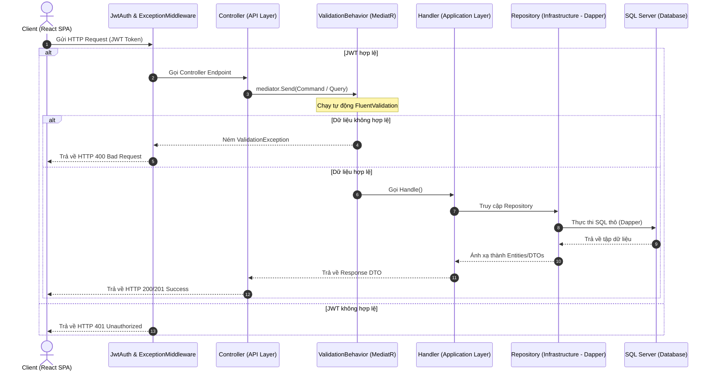

# Sơ đồ và Tài liệu Application Pipeline - TuneVault

Tài liệu này mô tả chi tiết luồng xử lý yêu cầu (**Application Pipeline**) cho **10 chức năng chính** của hệ thống **TuneVault (Media Streaming Web Application)** theo đúng mô hình Clean Architecture và MediatR CQRS.

Mỗi chức năng bao gồm ít nhất một **Command** (lệnh ghi) hoặc **Query** (yêu cầu đọc), đi qua các tầng kiểm tra hợp lệ dữ liệu (**Pipeline Behaviors / Validators**) trước khi đi vào **Handler** để thực thi nghiệp vụ và trả về kết quả (**DTO**).

---

## 1. Danh sách 10 Application Pipelines (Chú thích chi tiết từng dòng)

Dưới đây là chi tiết luồng xử lý (Application Pipeline) của 10 chức năng hệ thống theo cấu trúc MediatR CQRS, FluentValidation và Clean Architecture.

### 1.1. Chức năng 1: Xác thực (Authentication)
* **Đăng ký tài khoản (Register):**
```
RegisterCommand
  -> RegisterValidator             % Xác thực thông tin đầu vào (UserName, Email, Password) hợp lệ bằng FluentValidation
  -> ValidationBehavior            % MediatR Pipeline Behavior tự động kiểm tra lỗi và ném ValidationException nếu có
  -> RegisterHandler               % Xử lý nghiệp vụ: băm mật khẩu, lưu tài khoản qua Dapper và tạo JWT Token
  -> AuthResponseDto               % Trả về DTO chứa thông tin tài khoản và chuỗi JWT Token để xác thực các request sau
```

* **Đăng nhập (Login):**
```
LoginCommand
  -> LoginValidator                % Kiểm tra định dạng Email và Password không được trống
  -> ValidationBehavior            % MediatR Pipeline Behavior tự động xác thực dữ liệu đầu vào
  -> LoginHandler                  % Nghiệp vụ: xác thực thông tin đăng nhập trong DB, kiểm tra mật khẩu và cấp JWT Token
  -> AuthResponseDto               % Trả về DTO chứa thông tin đăng nhập và chuỗi JWT Token hợp lệ
```

### 1.2. Chức năng 2: Hồ sơ người dùng (User Profile)
* **Xem hồ sơ người dùng:**
```
GetProfileQuery
  -> ValidationBehavior            % Bỏ qua FluentValidation (Query này không cần validator)
  -> GetProfileHandler             % Truy vấn DB qua Dapper lấy thông tin hồ sơ người dùng (UserName, Email, UserImage, Bio)
  -> UserDTO                       % Trả về DTO chứa thông tin chi tiết hồ sơ người dùng hiển thị lên giao diện
```

* **Cập nhật hồ sơ người dùng:**
```
UpdateProfileCommand
  -> UpdateProfileValidator        % Xác thực dữ liệu cập nhật (UserName không trống, định dạng ảnh đại diện hợp lệ)
  -> ValidationBehavior            % MediatR Pipeline Behavior tự động kiểm duyệt lỗi đầu vào
  -> UpdateProfileHandler          % Nghiệp vụ: Cập nhật thông tin profile (UserName, UserImage, Bio) trong bảng AspNetUsers
  -> int                           % Trả về số dòng bị ảnh hưởng trong database (1: Thành công, 0: Thất bại)
```

### 1.3. Chức năng 3: Thư viện Media (Media Library)
* **Tải lên tệp phương tiện (Audio/Video):**
```
UploadMediaCommand
  -> UploadMediaValidator          % Kiểm tra tiêu đề, định dạng tệp (mp3, wav, mp4) và kích thước tệp tải lên
  -> ValidationBehavior            % MediatR Pipeline Behavior kiểm duyệt dữ liệu file đính kèm và metadata
  -> UploadMediaHandler            % Nghiệp vụ: lưu file vật lý qua FileStorageService và chèn metadata vào bảng MediaItem
  -> MediaItemDto                  % Trả về thông tin chi tiết tệp phương tiện vừa được tạo thành công trong hệ thống
```

### 1.4. Chức năng 4: Audio Player (Trình phát nhạc)
* **Truyền phát audio (HTTP Range Requests):**
```
GetMediaInfoQuery
  -> ValidationBehavior            % Bỏ qua FluentValidation (không cần validator)
  -> GetMediaInfoQueryHandler      % Lấy thông tin bài hát và đường dẫn vật lý tệp tin từ bảng MediaItem
  -> MediaItemDto                  % Trả về DTO chứa đường dẫn tệp để API Controller tạo luồng phát nhạc (HTTP Range Request 206)
```

* **Ghi nhận lịch sử nghe nhạc:**
```
RecordPlayHistoryCommand
  -> ValidationBehavior            % Bỏ qua FluentValidation (không cần validator)
  -> RecordPlayHistoryHandler      % Nghiệp vụ: Thêm bản ghi mới lưu vết người dùng vừa nghe bài hát vào bảng PlayHistory
  -> int                           % Trả về số lượng dòng bị ảnh hưởng (1: Đã lưu lịch sử thành công)
```

### 1.5. Chức năng 5: Video Player (Trình phát video)
* **Truyền phát video (HTTP Range Requests):**
```
GetMediaInfoQuery
  -> ValidationBehavior            % Bỏ qua FluentValidation (không cần validator)
  -> GetMediaInfoQueryHandler      % Lấy thông tin video và đường dẫn tệp video (.mp4, .webm) từ DB qua Dapper
  -> MediaItemDto                  % Trả về thông tin video phục vụ luồng truyền tải video chunk-by-chunk trên giao diện
```

### 1.6. Chức năng 6: Playlist (Danh sách phát)
* **Tạo danh sách phát mới:**
```
CreatePlaylistCommand
  -> CreatePlaylistValidator       % Xác thực thông tin đầu vào (PlaylistName không được để trống)
  -> ValidationBehavior            % MediatR Pipeline Behavior tự động xác thực tên playlist
  -> CreatePlaylistHandler         % Nghiệp vụ: Thực thi câu lệnh SQL INSERT tạo bản ghi mới trong bảng Playlist
  -> int                           % Trả về ID tự tăng của Playlist vừa được tạo thành công
```

* **Thêm bài hát vào danh sách phát:**
```
AddTrackToPlaylistCommand
  -> AddTrackToPlaylistValidator   % Xác thực sự tồn tại của PlaylistID và MediaItemID
  -> ValidationBehavior            % MediatR Pipeline Behavior kiểm tra tính hợp lệ của liên kết track-playlist
  -> AddTrackToPlaylistHandler     % Nghiệp vụ: Chèn bản ghi liên kết vào bảng trung gian PlaylistTrack
  -> int                           % Trả về số lượng dòng bị ảnh hưởng (1: Thêm bài hát thành công)
```

### 1.7. Chức năng 7: Tìm kiếm & Khám phá (Search & Discovery)
* **Tìm kiếm bài hát, nghệ sĩ, playlist:**
```
SearchMediaQuery
  -> SearchMediaValidator          % Kiểm tra từ khóa tìm kiếm (SearchTerm không trống) và tham số phân trang
  -> ValidationBehavior            % MediatR Pipeline Behavior tự động xác thực các tham số tìm kiếm
  -> SearchMediaQueryHandler       % Nghiệp vụ: Truy vấn Dapper thực hiện tìm kiếm đa bảng (MediaItem, Artist, Playlist)
  -> List<MediaItemDto>            % Trả về danh sách kết quả bài hát/video khớp với từ khóa kèm phân trang
```

### 1.8. Chức năng 8: Chia sẻ Media (Media Share)
* **Chia sẻ bài hát hoặc playlist cho người dùng khác:**
```
ShareMediaCommand
  -> ShareMediaValidator           % Xác thực sự tồn tại của ReceiverID, MediaItemID/PlaylistID và định dạng đầu vào
  -> ValidationBehavior            % MediatR Pipeline Behavior tự động kiểm duyệt dữ liệu chia sẻ
  -> ShareMediaHandler             % Nghiệp vụ: Tạo bản ghi MediaShare, tạo thông báo mới Notification, gửi realtime qua SignalR
  -> ShareMediaResponseDto         % Trả về DTO chứa thông tin chi tiết của giao dịch chia sẻ vừa hoàn thành
```

### 1.9. Chức năng 9: Thông báo (Real-time Notifications)
* **Lấy danh sách thông báo:**
```
GetNotificationsQuery
  -> ValidationBehavior            % Bỏ qua FluentValidation (không cần validator)
  -> GetNotificationsHandler       % Nghiệp vụ: Truy vấn bảng Notification lấy các thông báo của người dùng qua Dapper
  -> IEnumerable<NotificationDto>  % Trả về danh sách thông báo kèm payload chi tiết (chứa link, loại thông báo)
```

* **Đánh dấu thông báo đã đọc:**
```
MarkNotificationReadCommand
  -> ValidationBehavior            % Bỏ qua FluentValidation (không cần validator)
  -> MarkNotificationReadHandler   % Nghiệp vụ: Cập nhật trạng thái IsRead = true cho thông báo theo ID trong DB
  -> int                           % Trả về số dòng được cập nhật thành công (1: Thành công)
```

### 1.10. Chức năng 10: Tương tác & Lịch sử (Interaction & History)
* **Thêm bài hát vào danh sách yêu thích:**
```
AddFavoriteCommand
  -> ValidationBehavior            % Bỏ qua FluentValidation (không cần validator)
  -> AddFavoriteHandler            % Nghiệp vụ: Chèn cặp giá trị (UserID, MediaItemID) vào bảng Favorite qua Dapper
  -> int                           % Trả về số lượng dòng bị ảnh hưởng (1: Đã thích thành công)
```

* **Lấy danh sách lịch sử nghe nhạc gần đây:**
```
GetRecentPlayHistoryQuery
  -> ValidationBehavior            % Bỏ qua FluentValidation (không cần validator)
  -> GetRecentPlayHistoryHandler   % Nghiệp vụ: Truy vấn bảng PlayHistory lấy 10 bài hát đã phát gần nhất kèm thời gian
  -> IEnumerable<PlayHistoryDTO>   % Trả về danh sách DTO thông tin 10 bài hát được nghe gần nhất của người dùng
```

---

## 2. Mô tả chi tiết hoạt động của từng Pipeline

Dưới đây là mô tả chi tiết quy trình xử lý, các nghiệp vụ kiểm tra và bảng dữ liệu tương tác cho từng chức năng:

### 2.1. Chức năng 1: Xác thực (Authentication)
* **Đăng ký (Register)**: Người dùng điền thông tin đăng ký gửi lên API. Bộ validator `RegisterValidator` kiểm tra định dạng email và độ dài mật khẩu. MediatR `ValidationBehavior` tự động chặn luồng nếu phát hiện dữ liệu không hợp lệ. Khi dữ liệu đúng chuẩn, `RegisterHandler` thực hiện băm mật khẩu bằng thuật toán an toàn, chèn người dùng mới vào bảng `AspNetUsers` thông qua Dapper, và cấp phát JWT Token trong `AuthResponseDto`.
* **Đăng nhập (Login)**: Bộ kiểm tra `LoginValidator` đảm bảo email và mật khẩu không trống. `LoginHandler` tìm kiếm tài khoản theo email trong cơ sở dữ liệu, đối chiếu mật khẩu đã băm. Nếu trùng khớp, hệ thống tạo JWT Token đại diện cho phiên làm việc để client đính kèm vào header các request sau.

### 2.2. Chức năng 2: Hồ sơ người dùng (User Profile)
* **Xem hồ sơ**: Gửi `GetProfileQuery` chứa ID của người dùng. Handler `GetProfileHandler` thực thi truy vấn SELECT bằng Dapper trên bảng `AspNetUsers` để lấy các trường hồ sơ công khai như `UserName`, `UserImage`, `Bio` và trả về qua `UserDTO`.
* **Cập nhật hồ sơ**: Gửi `UpdateProfileCommand` để chỉnh sửa các trường thông tin cá nhân. Handler `UpdateProfileHandler` thực hiện câu lệnh SQL UPDATE cập nhật bảng `AspNetUsers` và trả về kết quả số dòng bị ảnh hưởng (1 nếu thành công).

### 2.3. Chức năng 3: Thư viện Media (Media Library)
* **Tải lên Media**: Người dùng hoặc nghệ sĩ gửi request POST dưới dạng `multipart/form-data` chứa file âm thanh/hình ảnh/video và thông tin bài hát. `UploadMediaValidator` kiểm duyệt kỹ đuôi tệp tin và giới hạn dung lượng tối đa. `UploadMediaHandler` tiến hành lưu file vật lý vào thư mục lưu trữ trên server thông qua `FileStorageService`, đồng thời lưu thông tin meta (như tên bài hát, thời lượng, tag thể loại, nghệ sĩ trình bày) vào bảng `MediaItem` trong cơ sở dữ liệu.

### 2.4. Chức năng 4: Audio Player (Trình phát nhạc)
* **Phát nhạc trực tuyến**: Khi người dùng click phát bài hát, Frontend gửi yêu cầu lấy thông tin. Handler `GetMediaInfoQueryHandler` lấy đường dẫn tệp tin lưu trên server từ bảng `MediaItem`. API Controller sử dụng cơ chế HTTP Range Request (HTTP 206) để trả về từng luồng dữ liệu (chunk) file nhạc giúp tối ưu băng thông và giảm độ trễ khi tua nhạc.
* **Ghi nhận lịch sử nghe**: Khi bài hát được phát (đáp ứng điều kiện thời gian tối thiểu), client gọi `RecordPlayHistoryCommand` để ghi vết người dùng đã nghe bài hát vào bảng `PlayHistory` phục vụ việc phân tích thói quen nghe nhạc của người dùng.

### 2.5. Chức năng 5: Video Player (Trình phát video)
* **Phát video**: Tương tự luồng phát nhạc, nhưng tối ưu cho việc tải luồng video có dung lượng lớn. `GetMediaInfoQueryHandler` sẽ tìm và trả về đường dẫn tệp video, sau đó video được truyền phát dưới dạng các phân đoạn nhỏ thông qua cơ chế HTTP 206 Range Request giúp hiển thị hình ảnh mượt mà trên UI.

### 2.6. Chức năng 6: Playlist (Danh sách phát)
* **CRUD Playlist**: Gửi yêu cầu tạo Playlist qua `CreatePlaylistCommand`. Handler `CreatePlaylistHandler` lưu tên, mô tả và chế độ hiển thị (công khai/riêng tư) của Playlist vào bảng `Playlist`.
* **Thêm bài hát**: Khi người dùng thêm bài hát vào danh sách phát, `AddTrackToPlaylistCommand` được kiểm tra tính hợp lệ bằng `AddTrackToPlaylistValidator` để đảm bảo bài hát và danh sách phát đều tồn tại. Handler chèn một bản ghi liên kết mới vào bảng trung gian `PlaylistTrack`.

### 2.7. Chức năng 7: Tìm kiếm & Khám phá (Search & Discovery)
* **Tìm kiếm nội dung**: Gửi `SearchMediaQuery` chứa từ khóa và tham số phân trang. Handler `SearchMediaQueryHandler` sử dụng các câu lệnh SQL JOIN để tìm kiếm đồng thời trên các bảng `MediaItem` (bài hát/video), `Artist` (nghệ sĩ) và `Playlist` (danh sách phát) theo từ khóa khớp tương đối, trả về kết quả định dạng phân trang đẹp mắt.

### 2.8. Chức năng 8: Chia sẻ Media (Media Share)
* **Chia sẻ nội dung**: Gửi `ShareMediaCommand` chứa thông tin người gửi, người nhận và ID bài hát/playlist. Handler `ShareMediaHandler` ghi bản ghi giao dịch vào bảng `MediaShare`, tạo một thông báo mới lưu vào bảng `Notification` và ngay lập tức gọi dịch vụ SignalR `INotificationPushService` để đẩy trực tiếp thông báo đến thiết bị của người nhận theo thời gian thực.

### 2.9. Chức năng 9: Thông báo (Real-time Notifications)
* **Nhận thông báo**: Khi người dùng mở app hoặc click vào chuông thông báo, Frontend gửi `GetNotificationsQuery`. Handler `GetNotificationsHandler` lấy danh sách thông báo chưa đọc của người dùng từ bảng `Notification`. Khi người dùng click xem thông báo, hệ thống gọi lệnh `MarkNotificationReadCommand` cập nhật cột `IsRead = 1` trong DB.

### 2.10. Chức năng 10: Tương tác & Lịch sử (Interaction & History)
* **Yêu thích bài hát (Like)**: Gửi `AddFavoriteCommand` để chèn bản ghi vào bảng `Favorite`, đánh dấu bài hát đã thích. Nếu bỏ thích, hệ thống gọi lệnh xóa bản ghi.
* **Lịch sử nghe nhạc**: Khi người dùng mở lịch sử phát nhạc, `GetRecentPlayHistoryQuery` sẽ được gửi lên. Handler truy vấn bảng `PlayHistory` lấy chính xác 10 bản ghi lịch sử nghe nhạc gần đây nhất của người dùng sắp xếp giảm dần theo thời gian phát `PlayedAt`.

---

## 3. Kiến trúc Pipeline chung (MediatR Behaviors)

Tất cả các pipeline trên đều được chạy qua mô hình Middleware Pipeline Behaviors của MediatR theo quy trình sau:


