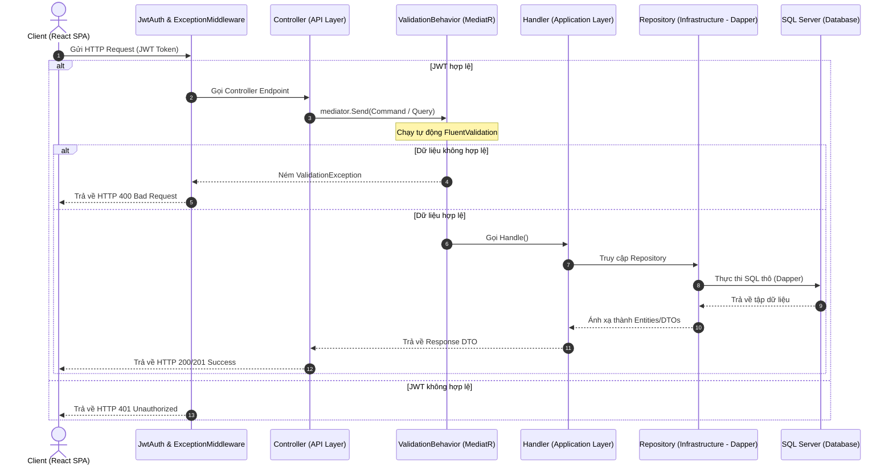

# Sơ đồ và Tài liệu Application Pipeline - TuneVault

Tài liệu này mô tả chi tiết luồng xử lý yêu cầu (**Application Pipeline**) cho **10 chức năng chính** của hệ thống **TuneVault (Media Streaming Web Application)** theo đúng mô hình Clean Architecture và MediatR CQRS.

Mỗi chức năng bao gồm ít nhất một **Command** (lệnh ghi) hoặc **Query** (yêu cầu đọc), đi qua các tầng kiểm tra hợp lệ dữ liệu (**Pipeline Behaviors / Validators**) trước khi đi vào **Handler** để thực thi nghiệp vụ và trả về kết quả (**DTO**).

---

## 1. Danh sách 10 Application Pipelines

### 1.1. Pipeline 1: Xác thực tài khoản (Authentication)
* **Command/Query**: `RegisterCommand` (Đăng ký) và `LoginCommand` (Đăng nhập).
* **Luồng xử lý**:
  1. Client gửi dữ liệu qua HTTP POST.
  2. `RegisterValidator` (FluentValidation) kiểm tra tính hợp lệ của DTO đầu vào (định dạng email, độ dài mật khẩu).
  3. `RegisterHandler`/`LoginHandler` thực hiện mã hóa mật khẩu, kiểm tra sự tồn tại của người dùng bằng Dapper (`DataContextDapper`), phát hành mã bảo mật JWT Token.
  4. Trả về kết quả: `AuthResponseDto` chứa thông tin tài khoản và JWT Token.

### 1.2. Pipeline 2: Tải lên phương tiện đa phương tiện (Upload MediaItem)
* **Command/Query**: `UploadMediaCommand`.
* **Luồng xử lý**:
  1. HTTP POST multipart form-data mang tệp tin gửi lên.
  2. `UploadMediaValidator` kiểm tra định dạng đuôi file (.mp3, .wav, .mp4, .webm) và kích thước tệp (max 20MB cho audio, 100MB cho video).
  3. `UploadMediaHandler` gọi `FileStorageService` ghi dữ liệu stream vật lý trực tiếp xuống đĩa cứng, sau đó gọi `IMediaItemRepository` chèn metadata vào database qua Dapper.
  4. Trả về kết quả: `MediaItemDto` chứa đầy đủ metadata bài hát/video.

### 1.3. Pipeline 3: Truyền phát & Phát nhạc (Playback & Streaming)
* **Command/Query**: `GetMediaInfoQuery`.
* **Luồng xử lý**:
  1. Frontend gửi yêu cầu lấy thông tin bài hát.
  2. `GetMediaInfoQueryHandler` truy vấn Dapper: `SELECT * FROM MediaItem WHERE MediaItemID = @ID` để lấy đường dẫn tệp.
  3. API Controller sử dụng `FileStreamResult` để trả về stream dạng chunk hỗ trợ HTTP Range Request (mã 206) để phát nhạc/video trực tuyến mà không cần tải toàn bộ tệp.
  4. Trả về kết quả: `MediaItemDto`.

### 1.4. Pipeline 4: Chia sẻ bài hát và Playlist (Share Media)
* **Command/Query**: `ShareMediaCommand`.
* **Luồng xử lý**:
  1. Client gửi yêu cầu chia sẻ bài hát/playlist tới người nhận.
  2. `ShareMediaValidator` kiểm tra tính hợp lệ của ReceiverID và MediaItemID/PlaylistID.
  3. `ShareMediaHandler` gọi Dapper kiểm tra trùng lặp (`AlreadySharedAsync`), ghi nhận bản ghi vào bảng `MediaShare`, chèn bản ghi thông báo mới vào bảng `Notification`, và gọi SignalR Hub để đẩy thông báo thời gian thực.
  4. Trả về kết quả: `ShareMediaResponseDto` chứa thông tin chi tiết lượt chia sẻ.

### 1.5. Pipeline 5: Nhận thông báo thời gian thực (Real-time Notifications)
* **Command/Query**: `GetNotificationsQuery`.
* **Luồng xử lý**:
  1. Frontend gửi yêu cầu tải thông báo khi mở ứng dụng.
  2. `GetNotificationsHandler` truy vấn cơ sở dữ liệu qua Dapper: `SELECT * FROM Notification WHERE UserID = @UserID` để lấy các thông báo chưa đọc.
  3. (Luồng Real-time): Khi có Handler khác (như Follow hay Share) chạy, hệ thống sẽ tiêm `INotificationPushService` để đẩy trực tiếp qua kết nối SignalR WebSocket.
  4. Trả về kết quả: `IEnumerable<NotificationDto>`.

### 1.6. Pipeline 6: Quản lý danh sách phát (Playlist Management - Create Playlist)
* **Command/Query**: `CreatePlaylistCommand` (hoặc `AddTrackToPlaylistCommand`).
* **Luồng xử lý**:
  1. Client gửi yêu cầu tạo danh sách phát mới.
  2. `CreatePlaylistHandler` thực thi câu lệnh SQL INSERT qua Dapper: `INSERT INTO Playlist (PlaylistName, IsPublic, Description, UserID) VALUES (...)`.
  3. Trả về kết quả: `int` (Playlist ID mới được sinh tự động).

### 1.7. Pipeline 7: Yêu thích bài hát (Favorite/Like Media)
* **Command/Query**: `AddFavoriteCommand` / `RemoveFavoriteCommand`.
* **Luồng xử lý**:
  1. Người dùng nhấn nút yêu thích (thả tim) trên giao diện.
  2. `AddFavoriteHandler` thực thi truy vấn Dapper: `INSERT INTO Favorite (UserID, MediaItemID) VALUES (@UserID, @MediaItemID)`.
  3. Trả về kết quả: `int` (số dòng bị ảnh hưởng, xác nhận thành công).

### 1.8. Pipeline 8: Ghi nhận lịch sử nghe nhạc (Play History Tracking)
* **Command/Query**: `RecordPlayHistoryCommand`.
* **Luồng xử lý**:
  1. Sau khi bài hát phát được 10 giây trên Frontend, Client gửi request lưu lịch sử.
  2. `RecordPlayHistoryHandler` thực thi câu lệnh SQL INSERT qua Dapper chèn một dòng vào bảng `PlayHistory` kèm thời gian `GETUTCDATE()`.
  3. Trả về kết quả: `int` (số dòng bị ảnh hưởng).

### 1.9. Pipeline 9: Gợi ý nhạc thông minh bằng AI (AI Recommendations)
* **Command/Query**: `GetRecommendationsQuery`.
* **Luồng xử lý**:
  1. Client yêu cầu danh sách gợi ý nhạc cá nhân hóa.
  2. `GetRecommendationsQueryHandler` lấy lịch sử nghe gần đây và danh sách bài hát yêu thích của người dùng qua Dapper, tạo thành Prompt chi tiết tiếng Việt gửi tới Google Gemini AI API.
  3. Gemini AI phản hồi danh sách 5 bài hát gợi ý. Handler phân tích cú pháp, truy vấn chi tiết bài hát bằng Dapper (có cơ chế dự phòng tự động sang thuật toán ngẫu nhiên nếu API AI lỗi).
  4. Trả về kết quả: `List<MediaItemRecommendationDto>`.

### 1.10. Pipeline 10: Tự động viết mô tả bài hát bằng AI (AI Description Generation)
* **Command/Query**: `GenerateMediaDescriptionCommand`.
* **Luồng xử lý**:
  1. Khi bài hát tải lên thành công, hệ thống gửi lệnh tạo mô tả.
  2. `GenerateMediaDescriptionHandler` gửi tên bài hát, ca sĩ, thể loại sang Gemini AI API để sinh đoạn văn cảm thụ nghệ thuật âm nhạc dài khoảng 100 từ.
  3. Mô tả được trả về và cập nhật ngược lại vào trường `Description` của `MediaItem` trong cơ sở dữ liệu qua Dapper.
  4. Trả về kết quả: `string` (Văn bản mô tả được tạo thành công).

---

## 2. Kiến trúc Pipeline chung (MediatR Behaviors)

Tất cả các pipeline trên đều được chạy qua mô hình Middleware Pipeline Behaviors của MediatR theo quy trình sau:

